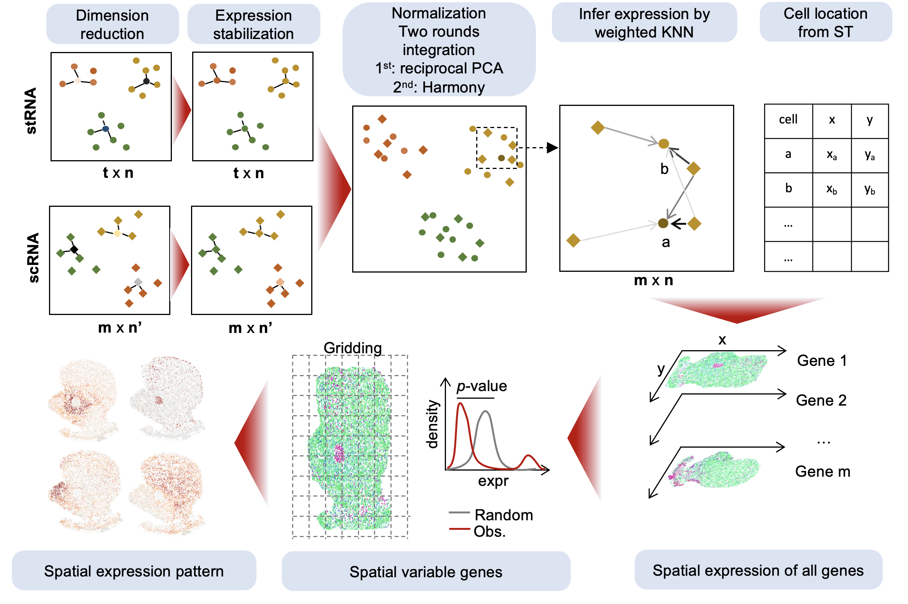

# iSpatial: infer spatial transcriptome

## infer and enhance probe-based spatial transcriptome by intergrating with scRNA-seq

### Rationale:

- For Probe-based spatial transcriptome (such as: merFISH, STARmap, seqFISH): 
	- target few genes
	- with spatial information of all cells
- For single cell RNA-seq:
	- detect all genes
	- with out spatial information


- **After infer:** transcriptome-wide spatial expression
	- all genes
	- with spatial information

### Methodology:



### Installation:

```
# This package based on Seurat and harmony.
# You can find more in:
# https://satijalab.org/seurat/articles/install.html
# https://github.com/immunogenomics/harmony
install.packages(c('Seurat', "harmony"))

install.packages("devtools") # if you have not installed "devtools" package
devtools::install_github("Czh3/iSpatial")
```

### Sample Datasets:

```
library(iSpatial)

# scRNA-seq data
data(NA_scRNA)

# merFISH data
data(NA_merFISH)
```

### Usage:

```
NA_merFISH_infer = infer(NA_merFISH, NA_scRNA)
```

For step by step usage, see [example](http://htmlpreview.github.io/?https://github.com/Czh3/iSpatial/blob/master/vignettes/introduction.html).

