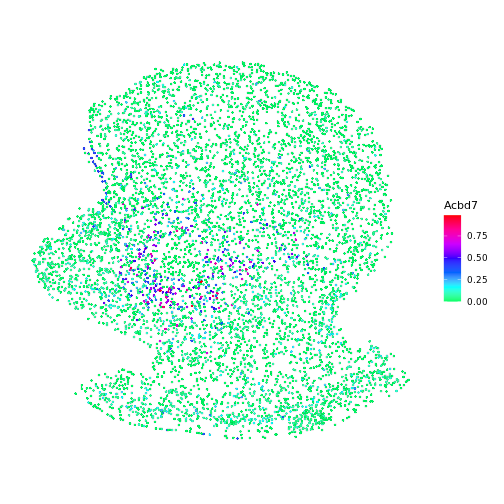
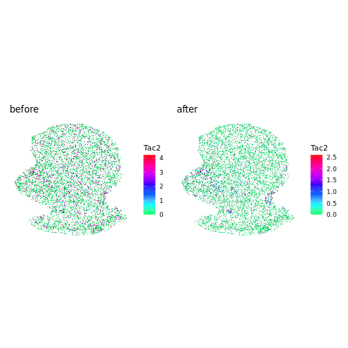
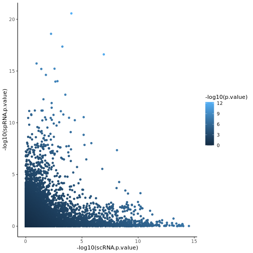
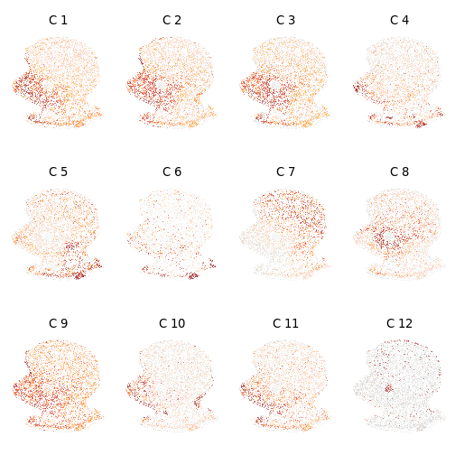
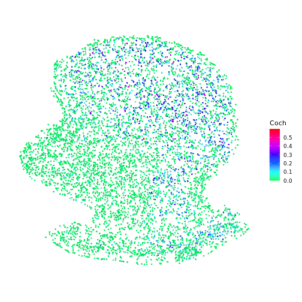

# iSpatail Tutorial

### load package

```r
# install iSpatial package
# devtools::install_github("Czh3/iSpatial")

# load
library(iSpatial)

library(Seurat)
library(ggplot2)
```

### load data
Load scRNA-seq and merFISH of Mouse Nucleus Accumbens.

```r
# scRNA-seq data
data(NA_scRNA)

# merFISH data
data(NA_merFISH)
```

### normalize data

```r
# scRNA-seq data
NA_scRNA = NormalizeData(NA_scRNA, verbose = FALSE)

# merFISH data
NA_merFISH = NormalizeData(NA_merFISH, verbose = FALSE)
```

### infer transcriptome-wide spatial expression

```r
# infer spatial transcriptome
NA_merFISH_iSpatial = iSpatial::infer(NA_merFISH, NA_scRNA)
#> Stablize spatial transcriptome.
#> 1st level integration
#> Merging dataset 2 into 1
#> Extracting anchors for merged samples
#> Finding integration vectors
#> Finding integration vector weights
#> Integrating data
#> normalization
#> 2nd level integration
#> Computing nearest neighbors
#> Only one graph name supplied, storing nearest-neighbor graph only
#> infer expression.
```


### Gene "Acbd7" is not in the merFISH targeted genes

```r
"Acbd7" %in% rownames(NA_merFISH)
#> [1] FALSE
```

### After inferring, we can get the spatial expression of Acbd7

```r
SpatialFeaturePlot(NA_merFISH_iSpatial, features = "Acbd7", stroke=0.1, slot="data") +
  theme(legend.position = "right") +
  scale_fill_gradientn(colours = c(rainbow(10)[5:10], "red"))
#> Warning: `guides(<scale> = FALSE)` is deprecated. Please use `guides(<scale> = "none")` instead.
#> Scale for 'fill' is already present. Adding another scale for 'fill', which will replace the existing scale.
```



### enhance the spatial expression of Tac2

```r
#raw expression
p1 = SpatialFeaturePlot(NA_merFISH, features = "Tac2", stroke=0.1, slot="data") +
  theme(legend.position = "right") + ggtitle("before") +
  scale_fill_gradientn(colours = c(rainbow(10)[5:10], "red"))
#> Warning: `guides(<scale> = FALSE)` is deprecated. Please use `guides(<scale> = "none")` instead.
#> Scale for 'fill' is already present. Adding another scale for 'fill', which will replace the existing scale.

# inferred
p2 = SpatialFeaturePlot(NA_merFISH_iSpatial, features = "Tac2", stroke=0.1, slot="data") +
  theme(legend.position = "right") + ggtitle("after") +
  scale_fill_gradientn(colours = c(rainbow(10)[5:10], "red"))
#> Warning: `guides(<scale> = FALSE)` is deprecated. Please use `guides(<scale> = "none")` instead.
#> Scale for 'fill' is already present. Adding another scale for 'fill', which will replace the existing scale.

p1 + p2
```



### Find spatial variable genes

```r
# run umap of scRNAseq data
NA_scRNA = FindVariableFeatures(NA_scRNA, verbose = FALSE)
NA_scRNA = ScaleData(NA_scRNA, verbose = FALSE)
NA_scRNA = RunPCA(NA_scRNA, verbose = FALSE)
NA_scRNA = RunUMAP(NA_scRNA, dims = 1:30, verbose = FALSE)

# Find spatial variable genes
SVGs_infer = iSpatial::spatial_variable_genes(spRNA.obj = NA_merFISH_iSpatial,
                                              spRNA.assay = "enhanced",
                                              scRNA.obj = NA_scRNA,
                                              scRNA.assay = "RNA",
                                              n.core = 10)
#> Warning: Adding image data that isn't associated with any assay present
SVGs_infer_sig = SVGs_infer[SVGs_infer$p.value < .01 & SVGs_infer$spRNA.p.value < .01, ]

ggplot2::ggplot(SVGs_infer, aes(-log10(scRNA.p.value), -log10(spRNA.p.value),
                                    gene = gene, color = -log10(p.value))) +
  geom_point()+
  theme_classic()
```



### group the SVGs into clusters based on spatial expression pattern

```r
gene_cluster = iSpatial::cluster_spatial_expr_pattern(NA_merFISH_iSpatial, "enhanced", 
                             feature = SVGs_infer_sig$gene, 
                             n.cluster = 12,
                             ncol.plot = 4, 
                             bin = 20,
                             n.core = 10)
#> Number of genes in each cluster:
#> SVG_cluster
#>   1   2   3   4   5   6   7   8   9  10  11  12 
#>  48 177 189  28  37  17  41  62  40  41  64  23
```



```r

# genes in cluster 7
names(gene_cluster[gene_cluster==7])
#>  [1] "2010001M06Rik" "2310075C17Rik" "8030453O22Rik" "Abi3bp"        "Actn2"         "Acvr1c"        "Adcy1"         "Arg2"         
#>  [9] "BB031773"      "Cacng1"        "Ccbp2"         "Cited4"        "Clec12a"       "Cnr1"          "Coch"          "Col19a1"      
#> [17] "Cyp2a5"        "Dgat2l6"       "E230025N22Rik" "E530001K10Rik" "Epor"          "Fabp4"         "Fgf3"          "Fibcd1"       
#> [25] "Galnt14"       "Gbx1"          "Gm16075"       "Gpx6"          "Igfbp6"        "Il20ra"        "Mas1"          "Mme"          
#> [33] "Onecut2"       "Rab3b"         "Reln"          "Slc16a3"       "Snai3"         "Sprr1a"        "Syt2"          "Tmprss6"      
#> [41] "Wt1"

# plot
SpatialFeaturePlot(NA_merFISH_iSpatial, features = "Coch", stroke=0.1, slot="data") +
  theme(legend.position = "right") + 
  scale_fill_gradientn(colours = c(rainbow(10)[5:10], "red"))
#> Warning: `guides(<scale> = FALSE)` is deprecated. Please use `guides(<scale> = "none")` instead.
#> Scale for 'fill' is already present. Adding another scale for 'fill', which will replace the existing scale.
```




```r
sessionInfo()
#> R version 4.0.5 (2021-03-31)
#> Platform: x86_64-conda-linux-gnu (64-bit)
#> Running under: Ubuntu 20.04.3 LTS
#> 
#> Matrix products: default
#> BLAS/LAPACK: /netscr/chaozhang/miniconda3/lib/libopenblasp-r0.3.18.so
#> 
#> locale:
#>  [1] LC_CTYPE=en_US.UTF-8       LC_NUMERIC=C               LC_TIME=en_US.UTF-8        LC_COLLATE=en_US.UTF-8     LC_MONETARY=en_US.UTF-8   
#>  [6] LC_MESSAGES=en_US.UTF-8    LC_PAPER=en_US.UTF-8       LC_NAME=C                  LC_ADDRESS=C               LC_TELEPHONE=C            
#> [11] LC_MEASUREMENT=en_US.UTF-8 LC_IDENTIFICATION=C       
#> 
#> attached base packages:
#> [1] stats     graphics  grDevices utils     datasets  methods   base     
#> 
#> other attached packages:
#> [1] rmarkdown_2.11     knitr_1.36         ggplot2_3.3.5      SeuratObject_4.0.2 Seurat_4.0.5       iSpatial_1.0.0    
#> 
#> loaded via a namespace (and not attached):
#>   [1] plyr_1.8.6            igraph_1.2.7          lazyeval_0.2.2        splines_4.0.5         crosstalk_1.2.0       listenv_0.8.0        
#>   [7] scattermore_0.7       usethis_2.1.3         digest_0.6.28         foreach_1.5.1         htmltools_0.5.2       fansi_0.5.0          
#>  [13] magrittr_2.0.1        memoise_2.0.0         tensor_1.5            cluster_2.1.2         doParallel_1.0.16     ROCR_1.0-11          
#>  [19] remotes_2.4.1         globals_0.14.0        matrixStats_0.61.0    spatstat.sparse_2.0-0 prettyunits_1.1.1     colorspace_2.0-2     
#>  [25] ggrepel_0.9.1         xfun_0.28             dplyr_1.0.7           callr_3.7.0           crayon_1.4.2          jsonlite_1.7.2       
#>  [31] spatstat.data_2.1-0   survival_3.2-13       zoo_1.8-9             iterators_1.0.13      glue_1.4.2            polyclip_1.10-0      
#>  [37] gtable_0.3.0          leiden_0.3.9          pkgbuild_1.2.0        future.apply_1.8.1    abind_1.4-5           scales_1.1.1         
#>  [43] pheatmap_1.0.12       DBI_1.1.1             miniUI_0.1.1.1        Rcpp_1.0.7            viridisLite_0.4.0     xtable_1.8-4         
#>  [49] riverplot_0.10        reticulate_1.22       spatstat.core_2.3-1   bit_4.0.4             mclust_5.4.9          htmlwidgets_1.5.4    
#>  [55] httr_1.4.2            FNN_1.1.3             RColorBrewer_1.1-2    ellipsis_0.3.2        ica_1.0-2             farver_2.1.0         
#>  [61] pkgconfig_2.0.3       uwot_0.1.10           deldir_1.0-6          utf8_1.2.2            rliger_1.0.0          labeling_0.4.2       
#>  [67] tidyselect_1.1.1      rlang_0.4.12          reshape2_1.4.4        later_1.2.0           munsell_0.5.0         tools_4.0.5          
#>  [73] cachem_1.0.6          cli_3.1.0             generics_0.1.1        devtools_2.4.2        ggridges_0.5.3        evaluate_0.14        
#>  [79] stringr_1.4.0         fastmap_1.1.0         yaml_2.2.1            goftest_1.2-3         processx_3.5.2        bit64_4.0.5          
#>  [85] fs_1.5.0              fitdistrplus_1.1-6    purrr_0.3.4           RANN_2.6.1            pbapply_1.5-0         future_1.23.0        
#>  [91] nlme_3.1-153          mime_0.12             hdf5r_1.3.3           compiler_4.0.5        rstudioapi_0.13       plotly_4.10.0        
#>  [97] png_0.1-7             testthat_3.1.0        spatstat.utils_2.2-0  tibble_3.1.5          stringi_1.7.5         highr_0.9            
#> [103] ps_1.6.0              RSpectra_0.16-0       desc_1.4.0            lattice_0.20-45       Matrix_1.3-4          SeuratDisk_0.0.0.9019
#> [109] ggsci_2.9             vctrs_0.3.8           pillar_1.6.4          lifecycle_1.0.1       spatstat.geom_2.3-0   lmtest_0.9-38        
#> [115] RcppAnnoy_0.0.19      data.table_1.14.2     cowplot_1.1.1         irlba_2.3.3           httpuv_1.6.3          patchwork_1.1.1      
#> [121] R6_2.5.1              promises_1.2.0.1      KernSmooth_2.23-20    gridExtra_2.3         parallelly_1.28.1     sessioninfo_1.2.1    
#> [127] codetools_0.2-18      MASS_7.3-54           assertthat_0.2.1      pkgload_1.2.3         rprojroot_2.0.2       withr_2.4.2          
#> [133] sctransform_0.3.2     harmony_0.1.0         mgcv_1.8-38           parallel_4.0.5        grid_4.0.5            rpart_4.1-15         
#> [139] tidyr_1.1.4           Rtsne_0.15            pROC_1.18.0           shiny_1.7.1
```

